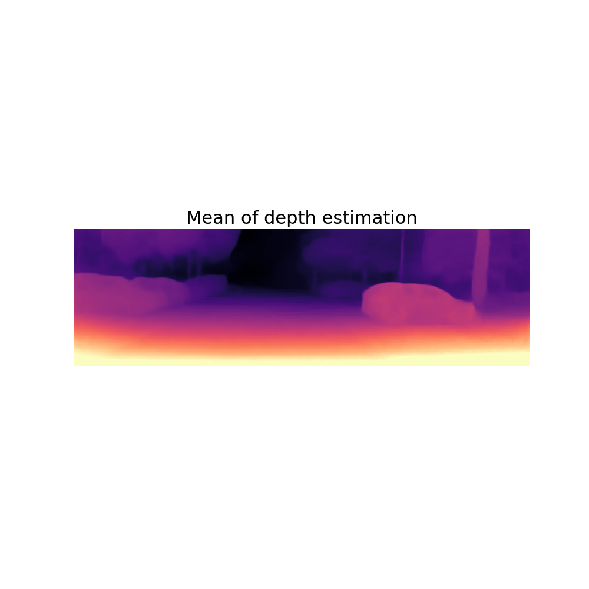
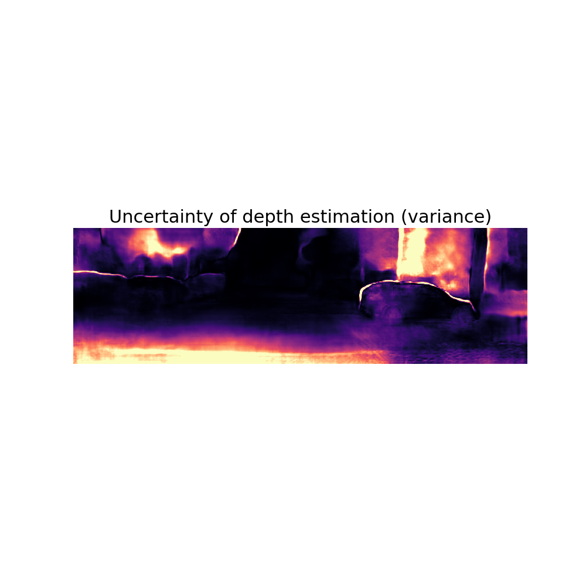

## Abstract 

In this work, I have two main objectives. Firstly, I will implement a selfsupervised
training algorithm for a neural network tasked with predicting pixelwise
depth maps. Secondly, I will explore and assess various methodologies
to generate measures of uncertainty. These methodologies will calculate both
per-pixel depth values, typically represented as the mean of a set of inferences,
and per-pixel uncertainties, typically expressed as variance. Subsequently, I
will evaluate these methodologies through qualitative analysis, examining if regions
of high uncertainty align with challenging sections of the input image.
Additionally, I will conduct quantitative assessments using standard regression
performance metrics such as RMSE, and investigate whether high uncertainty
correlates with regression errors.

## Current Result 
### Mean

### Variance
